# **CSE 15L Lab Report 1 Guide** by Emily Mills

This guide will cover:
```
1) Downloading Visual Studio Code
2) Remotely Connecting
3) Trying Commands
4) Moving Files Using SCP
5) Setting an SSH Key
6) Optimizing Remote Running
```

## **Step 1 - Downloading Visual Studio Code**
---
Visit this website and follow the instructions [Visual Studio Code Download](https://code.visualstudio.com/). Once Downloaded, run the application and you should see a screen that looks like this:


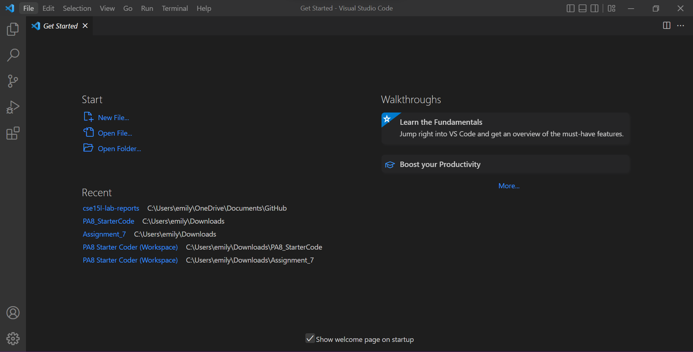

## **Step 2 - Remotely Connecting**
---
If you have a **Windows** Computer, you will need to [Install OpenSSH](https://learn.microsoft.com/en-us/windows-server/administration/openssh/openssh_install_firstuse?tabs=gui). Only install OpenSSH **client**, not OpenSSH server. Once installed, you will see it here:


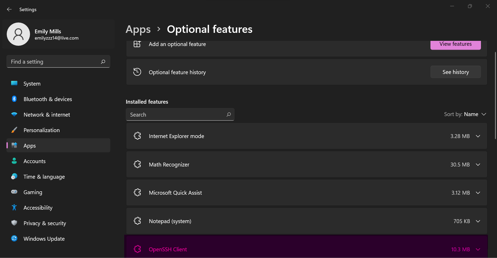


***Note**: You may already have it installed (I did!)*

 Next, you will need the username to your CSE 15L account. Visit [Account Lookup Tool](https://sdacs.ucsd.edu/~icc/index.php) to find your username. 

 Now using VS Code, open a new terminal and enter the following:
```
ssh cs15lfa22__@ieng6.ucsd.edu 
 ```
***Note**: The __ should be replaced by the two digits in your username.*

If it is your first time logging in, you will be prompted with a confirmation message. Type and enter `yes` into the terminal. When you are prompted to type in your password, any keyboard activity will not show up on the terminal for privacy reasons. *There is still input even if you can't see it*. After entering your password, you will see something similar to this: 


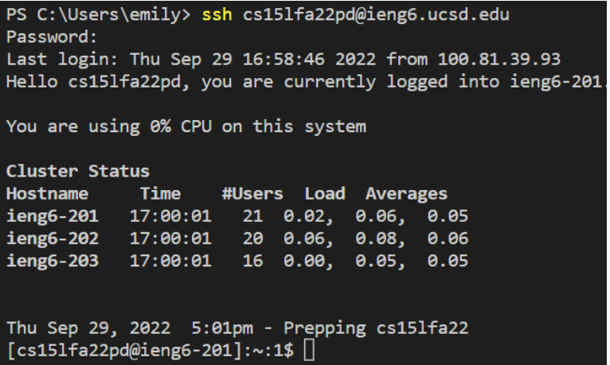

***Note**: Mine does not show the yes/no prompting because it was not my first time logging in*.

**Now you are successfully logged into a computer in the CSE building!**

- To logout of the **remote server** and back into your own **client**, use: 
```
Ctrl-D
```


## **Step 3 - Trying Commands**
---

Practice some commands on both the remote server and your own client. 

**Example Commands:**

- cd ~
- cd
- ls -lat
- ls -a
- ls <**directory**> where <**directory**> is /home/linux/ieng6/cs15lfa22/cs15lfa22__, where the __ is one of the other group members’ username
- cp /home/linux/ieng6/cs15lfa22__/public/hello.txt ~/
- cat /home/linux/ieng6/cs15lfa22__/public/hello.txt


*This is what happens when I enter the command **ls -lat** on the **remote server:***


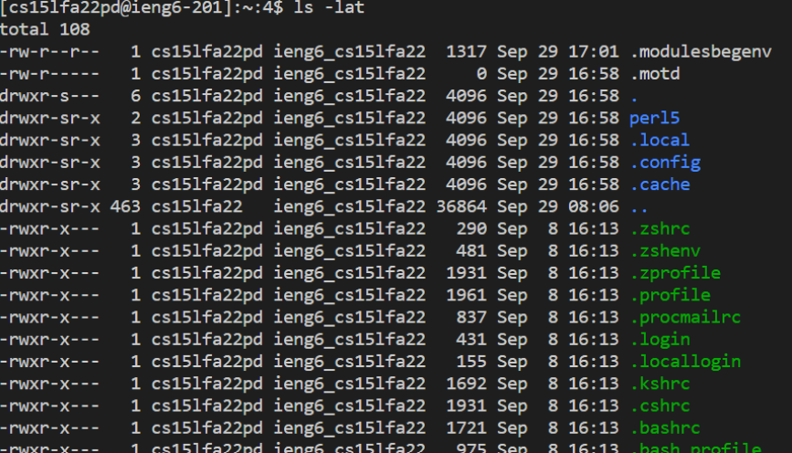


*This is what happens when I enter the command **ls -lat** on **my client:***


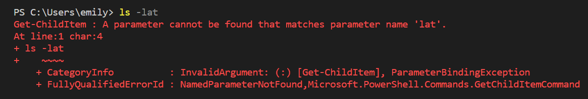


## **Step 4 - Moving Files Using SCP**
---

To move a file using SCP, you first need to have/make a file on your own client (you can make it in VSC).

**My file on my own client:**
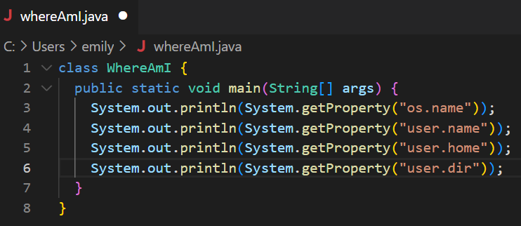

**Run:**
```
javac file_name.java
java file_name
```

**Next, in your client terminal (the one you are currently in), run:**

```
scp file_name.java cs15lfa22__@ieng6.ucsd.edu:~/
```

*You will be prompted for your password. Type it in (this will not log you into your remote server, even though it requires a password).*

**My example:**


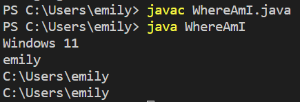
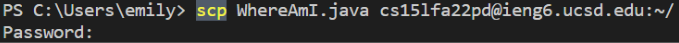


**Next, sign into the remote client (see Step 2 for reference). Once logged in, use `javac` and `java` from before:**

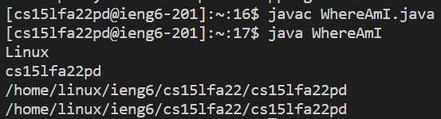

*The file is now on your remote client!*


## **Step 5: Setting an SSH Key**
---
Setting an SSH Key will allow you to login without having to type your password! 

**On the client terminal (your computer), you will type the following underlined in pink:**

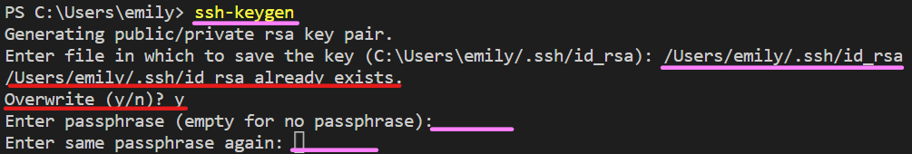

***Note:** for the passphrase, it's most efficient to leave it empty (meaning it will not require a password when you log in). **Ignore everything underlined in red.***


**Next, Login to your remote server (it will still require a password for now). Once logged in, run:**

```
mkdir .ssh
```

**Logout, and on your own client terminal run:**


```
scp /Users/your_name/.ssh/id_rsa.pub cs15lfa22__@ieng6.ucsd.edu:~/.ssh/authorized_keys
```


*You should now be able to login with SSH and transfer files using SCP without a password!*


## **Step 6: Optimizing Remote Running**
---
**Fun Fact:** you can use the command `ssh cs15lfa22__@ieng6.ucsd.edu` with any command after in quotation marks. It will log you into the remote server, run the command, and then log you out. 

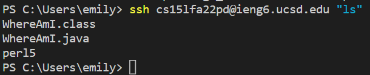

**Another Fun Fact:** you can run multiple commands separated by a semicolon on a single line of code. 

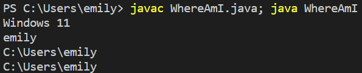


