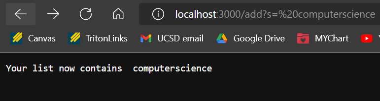
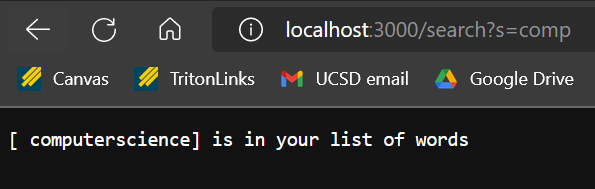
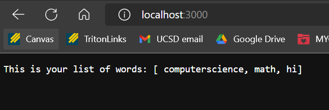
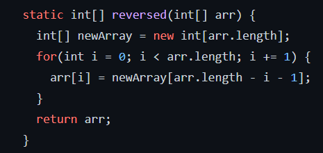
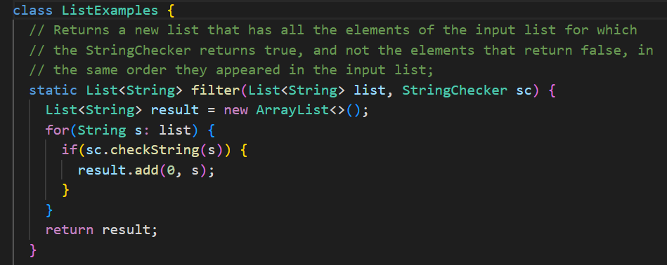
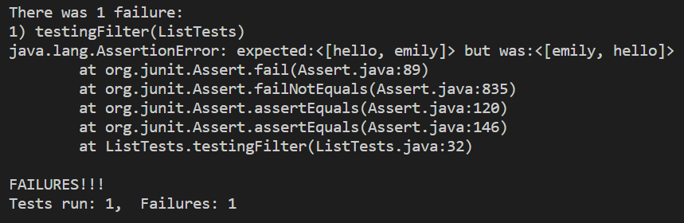
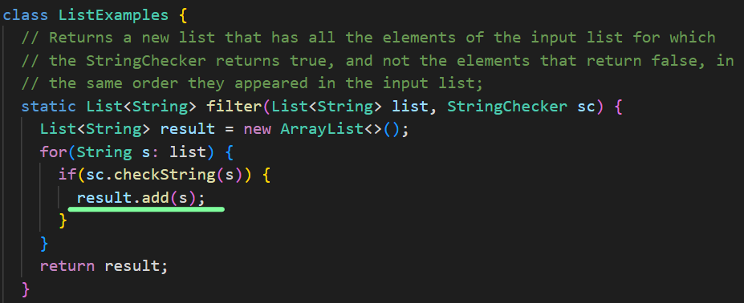

# **CSE 15L Lab Report Week 3** by Emily Mills
## **Part 1**
---

```java
import java.io.IOException;
import java.net.URI;
import java. util. ArrayList;

class Handler implements URLHandler {
    // The one bit of state on the server: a number that will be manipulated by
    // various requests.

    ArrayList<String> listOfWords = new ArrayList<String>();
    ArrayList<String> returningWords = new ArrayList<String>();

    public String handleRequest(URI url) {
        if (url.getPath().equals("/")) {
            return String.format("This is your list of words: %s", listOfWords.toString());
        }
        else if (url.getPath().equals("/add")) {
             System.out.println("Path: " + url.getPath());
             String[] parameters = url.getQuery().split("=");
             if (parameters[0].equals("s")) {
                listOfWords.add(parameters[1]);
                return String.format("Your list now contains %s", parameters[1]);

             }
        }
        else if (url.getPath().equals("/search")) {
            System.out.println("Path: " + url.getPath()); 
            String[] parameters = url.getQuery().split("=");
            if (parameters[0].equals("s")) {
                returningWords.clear();
                for (String words: listOfWords) {
                    if (words.contains(parameters[1])) {
                        returningWords.add(words);
                    }
                }
                return String.format("%s is in your list of words", returningWords.toString());
            }
        }
        return "404 Not Found!";
    }
}

class SearchEngine {
    public static void main(String[] args) throws IOException {
        if(args.length == 0){
            System.out.println("Missing port number! Try any number between 1024 to 49151");
            return;
        }

        int port = Integer.parseInt(args[0]);

        Server.start(port, new Handler());
    }
}
```

**Adding to the List:**





/add?s=computerscience calls the handlerequest method. It recognizes /add and adds in "computerscience" to the list of words. 


**Searching for "comp":**





/search?s=comp calls the handlerequest method. It recognizes /search and searches the list of words for any of them that contain "comp".


**Showing the full list of words:**





the original link calls the handlerequest method and prints the list of words (since there is no text after the "3000")

## **Part 2**
---
### **Bug in ArrayExamples.java:**

In the method: reversed, there contains a bug! 
Here is the starter code:





**The failure inducing input/code of the test:**

```java
@Test
  public void testReversed2() {
    int[] input1 = {1,2,3,4,5};
    assertArrayEquals(new int[]{5,4,3,2,1}, ArrayExamples.reversed(input1));
  }
```
**Symptom:** arrays first differed at element [0]; expected:<5> but was:<0>

**The bug:**

The issue with this code is that newArray is initialized with size 5, but rather than copying over the code from arr into newArray, they copy over newArray (which is empty initially) into arr. The issue is that the bugged code returns arr (it should return newArray).
Here is the revised code:
```java 
static int[] reversed(int[] arr) {
    int[] newArray = new int[arr.length];
    for(int i = 0; i < arr.length; i += 1) {
      newArray[i] = arr[arr.length - i - 1];
    }
    return newArray;
  }
```

**Explanation:**

In this revised code, it uses a loop to copy over the contents from arr into newArray (in the reversed order). 

In the bugged code, newArray is initialized with size 5, but none of the contents are copied over (meaning at every index, the value is 0). When copied into input1, every value in input1 becomes 0. 


### **Bug in ListExamples.java:**


In the method: filter, there contains a bug! Here is the starter code:




Here is the condition for StringChecker:
```java
class Checking implements StringChecker {
    public boolean checkString(String stringj) {
        if (stringj.length() == 5) {
            return true;
        }
        else {
            return false;
        }
    }
}
```


**The failure inducing input/code of the test:**
```java
public class ListTests {
    @Test
    public void testingFilter() {
        List<String> newList = new ArrayList<>();
        newList.add("hello");
        newList.add("it's");
        newList.add("nice");
        newList.add("to");
        newList.add("meet");
        newList.add("you");
        newList.add("emily");
        List<String> expected = new ArrayList<>();
        expected.add("hello");
        expected.add("emily");
        StringChecker sc = new Checking();
        assertEquals(expected, ListExamples.filter(newList, sc)); 
    }
}
```

**Symptom:**




**The bug:** 

The issue with this code is that it returns the right answer, just in the wrong order. That is because of line 14 in ListExamples.java
```java
result.add(0, s);
```
This line adds the new string to the 0th index (the front of the list), rather to the end of the list. Here is the revised code (underlined in green):



**Explanation:**

In the revised code, string will be added to the end of the list.

In the bugged code, the string was added to the front of the list. When it meets the condition of having 5 characters, it will be added to the front of the list. "hello" is added to the front of the list. Then, "emily" is added to the front of the list, resulting in <[emily,hello]>.


