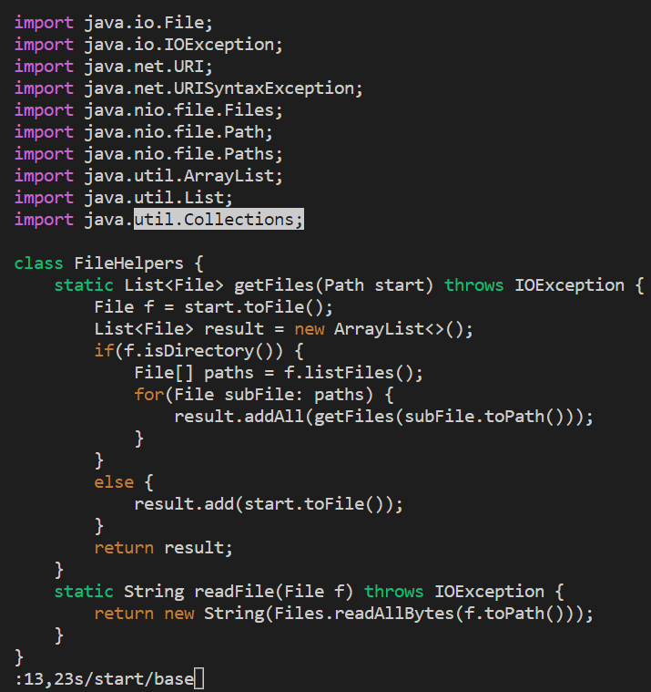
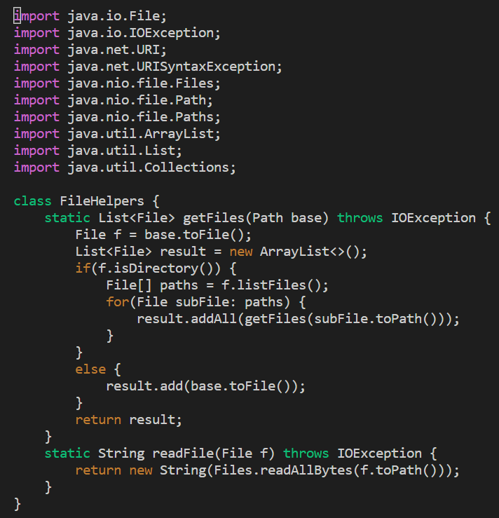
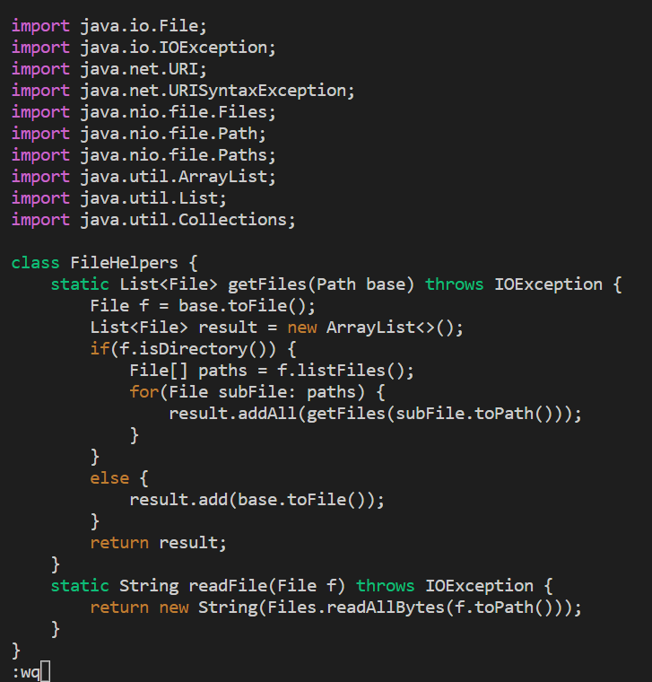
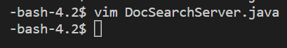

### **CSE15L Lab Report 4 Week 7** by Emily Mills

## **Part 1:** changing *start* to *base*

**Shortest Sequence:** 

`<shift>:13,23s/start/base <enter> <shift>: wq <enter>`

---

**Step 1:** `<shift>:13,23s/start/base`

This will not change anything to the file just yet, but prepares you to change all *start* to *base* from lines 13 to 23.

**Step 2:** `<enter>`

Once you hit enter, all of the *start* words will change to *base* from lines 13 to 23.

**Step 3:** `<shift>: wq`

This will prepare you to save the file and exit vim.

**Step 4:** `<enter>`

When you press enter, your file will be saved and you will return to the terminal. 

## **Part 2:** comparing scp and vim 

**First Way:** Editing the file directly in vsc, copying it over to the remote, and running bash test.sh took **22.33 seconds**.

**Second Way** Using vim in the remote to edit and save the file, then running bash test.sh took **10.15 seconds**.

No issues came up for either method, but using vim was more time efficient. 

**Question 1:**
If I had to work on a program that I was running remotely, I would prefer to edit in vsc and copy it over to the remote. I do not feel entirely comfortable using vim. While doing this lab, I had to constantly refer to the vim commands. If I gained proficiency in vim, I would defintely prefer to use it. However, I am more comfortable using the standard keyboard typing, even if it might take a bit longer. I also think vim would increase the amount of errors I made. 

**Question 2:** 
If I had a time constraint and were to gain proficiency in vim, I would use vim. Otherwise, I would use vsc and scp the files over. 

